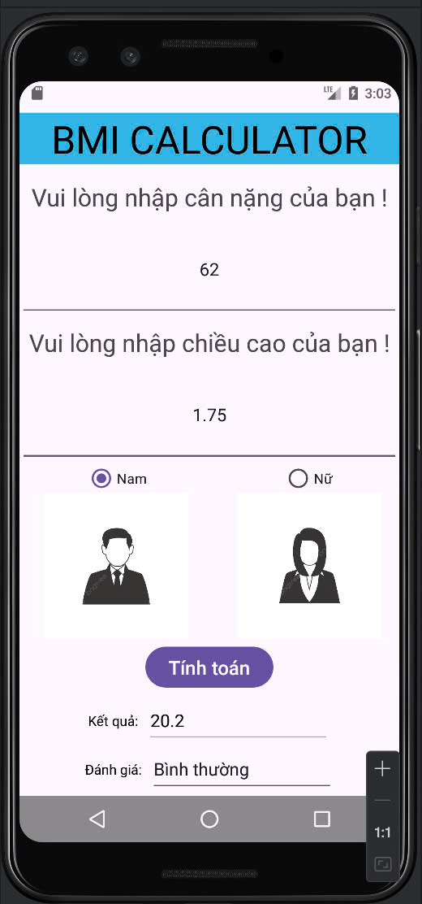
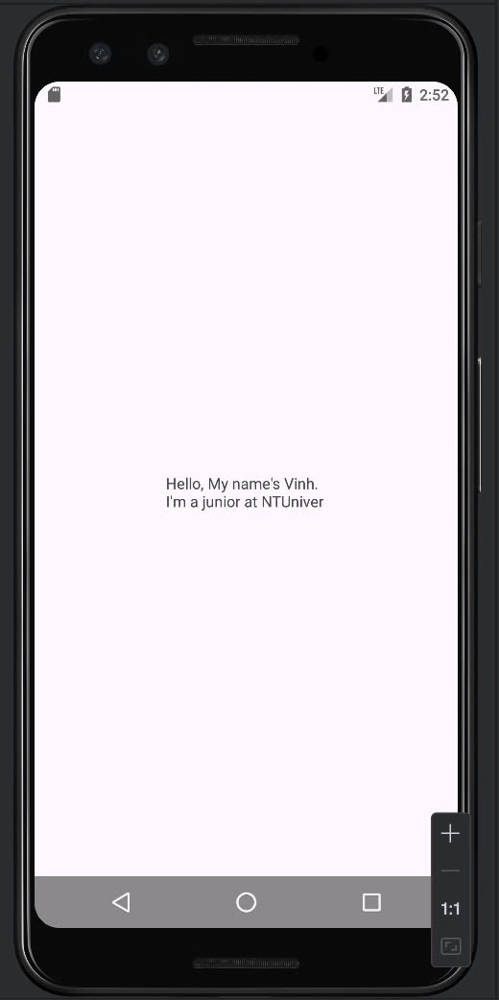
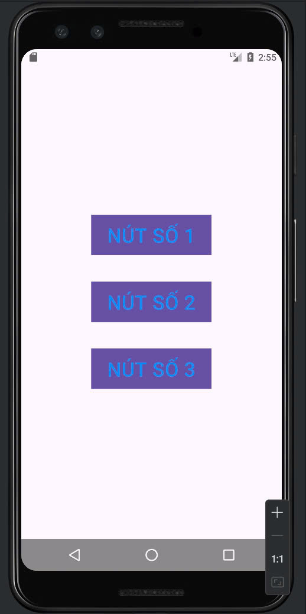
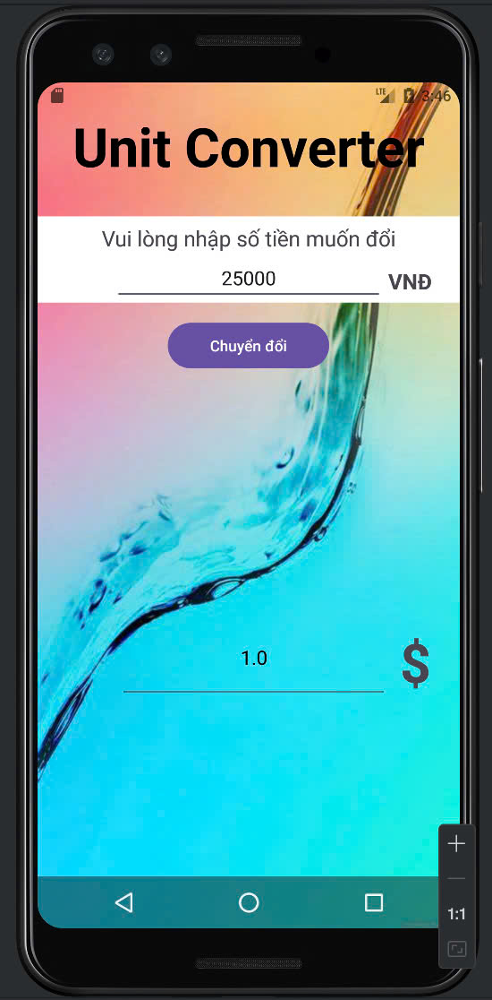

# Tên Ứng Dụng Di Động
# Lập trình Ứng Dụng Di Động

 <!-- Thay thế bằng đường dẫn đến logo của ứng dụng -->
 <!-- Thay thế bằng đường dẫn đến logo của ứng dụng -->

Một ứng dụng di động được phát triển bằng [Flutter/React Native/Kotlin/Swift] giúp [mô tả ngắn gọn về mục đích của ứng dụng].
Một ứng dụng di động được phát triển bằng AndroidStudio.

## Tính Năng

