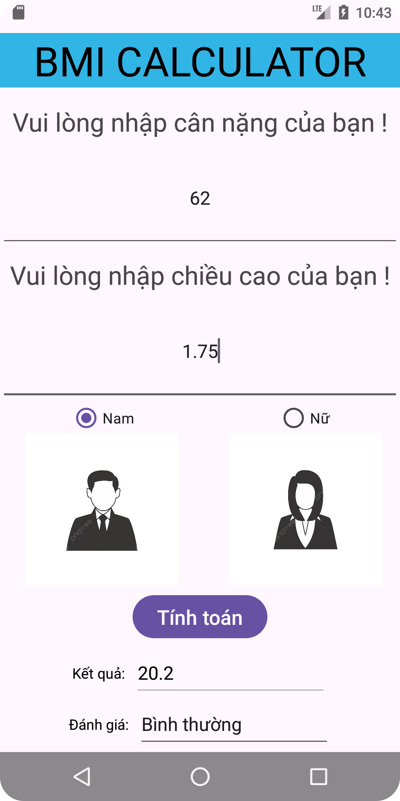

# Tên Ứng Dụng Di Động
# Lập trình Ứng Dụng Di Động

 <!-- Thay thế bằng đường dẫn đến logo của ứng dụng -->
 <!-- Thay thế bằng đường dẫn đến logo của ứng dụng -->

Lưu trữ các bài tập của tôi.
Một ứng dụng di động được phát triển bằng AndroidStudio.

## Tính Năng
# Ex1 HelloWord

# Ex2 LinearLayout

# Ex3 SimpleSumApp

# Ex 4 BMIConculator

# Ex 5 ConvertUnit

  <h4>Ex6: <a href = "https://github.com/subin663/64139010-AndroidProgramming/tree/main/Ex6_IntentDonGian">Ex6_LoginBasic</a></h4>
  
  
    

  
 

  <h4>Ex7: <a href = "https://github.com/subin663/64139010-AndroidProgramming/tree/main/Ex7_IntentLogin">Ex7_IntentLogin</a></h4>
  
  
  

