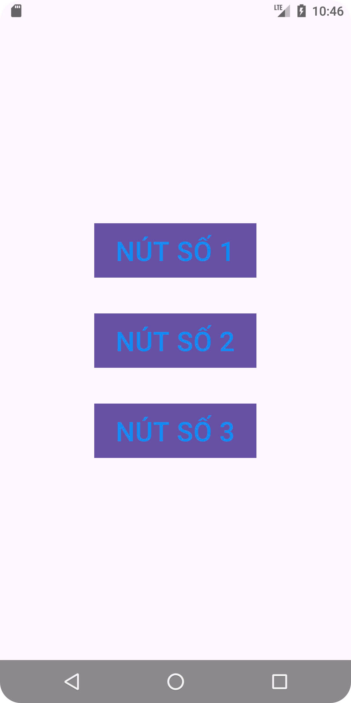

# Tên Ứng Dụng Di Động
# Lập trình Ứng Dụng Di Động

 <!-- Thay thế bằng đường dẫn đến logo của ứng dụng -->
 <!-- Thay thế bằng đường dẫn đến logo của ứng dụng -->

Lưu trữ các bài tập của tôi.
Một ứng dụng di động được phát triển bằng AndroidStudio.

## Tính Năng
# Ex1 HelloWord

# Ex2 LinearLayout

# Ex3 SimpleSumApp

# Ex 4 BMIConculator

# Ex 5 ConvertUnit

  <h4>Bottom Navigation View: <a href = "">BottomNavigationView</a></h4>
  
  
  

